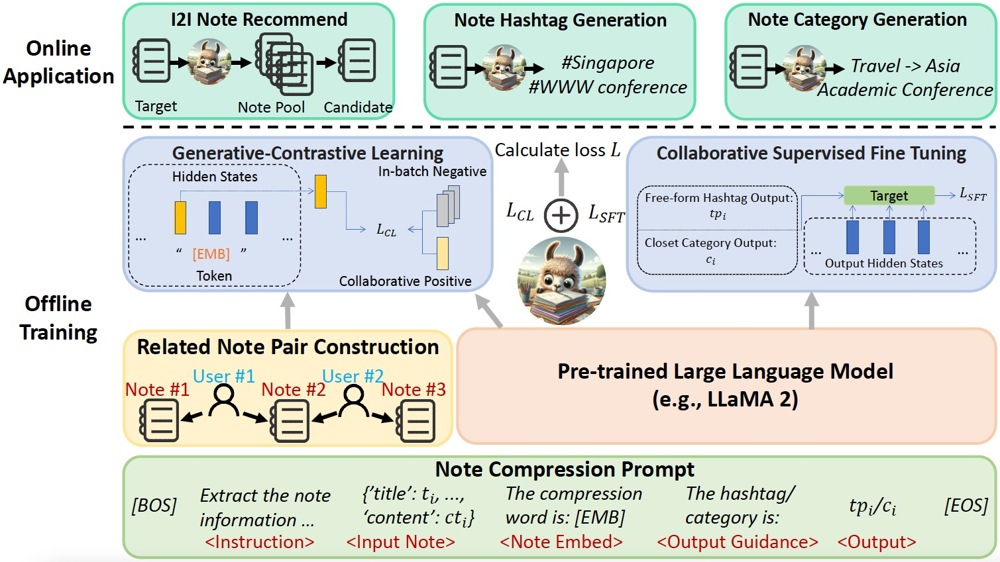
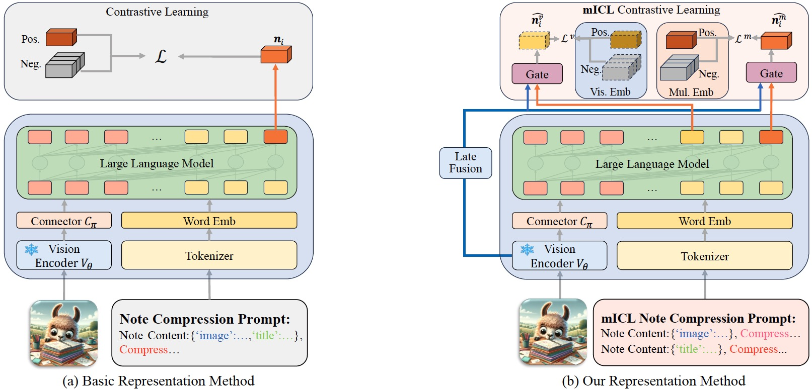

<p align="center" width="100%">

</p>

# Source Code for NoteLLM and NoteLLM-2

## Overview

Users produce massive amounts of new information daily on User-Generated Content (UGC) platforms like Xiaohongshu. Due to diverse content domains and complex multimodal information, existing representation models struggle to fully comprehend these contents, leading to suboptimal performance in downstream tasks like recommendations. Recently, Large Language Models (LLMs) have shown great generalization and understanding. It is promising to introduce LLMs to enhance the representations for content, which is fundamental for various downstream tasks.

### NoteLLM
<p align="center" width="100%">

</p>

This work finds that generating hashtags/categories is similar to producing note embeddings. Both compress the key note information into limited content. Therefore, learning to generate hashtags/categories can potentially enhance the quality of embeddings. Inspired by these insights, we propose a unified framework, which merges the embedding generation and topic generation into one task.

### NoteLLM-2
<p align="center" width="100%">

</p>

While NoteLLM shows promising improvements, it is limited to processing only textual information. In NoteLLM-2, we enhance our solution by incorporating multimodal inputs, which is crucial for Xiaohongshu's platform. Rather than relying on existing Multimodal Large Language Models (MLLMs), we propose the end-to-end fine-tuning strategy, requiring no alignment and offering better practicality and efficiency. However, this strategy faces visual ignorance through our deep analysis. To solve this, we design two easy and effective mechanisms (mICL and late fusion) to enhance multimodal representations.

For more details, please check our papers: **NoteLLM: A Retrievable Large Language Model for Note Recommendation**, and **NoteLLM-2: Multimodal Large Representation Models for Recommendation**.

## Getting Started
### Environment Setup

Clone our repository and set up an environment by running `env.sh`.

```bash
git clone https://github.com/zcfinal/NoteLLM.git
cd NoteLLM
bash env.sh
```

### Code Structure

The code is organized as follows:

```
├── code
    ├── ds_config: Configuration files for DeepSpeed.
    ├── model: Model-related files.
    ├── test_script: Scripts for inference and evaluation.
    ├── train_script: Scripts for training models.
    ├── data.py: Module for loading data.
    ├── eval_generation.py: Evaluation for generation tasks.
    ├── eval_recall.py: Evaluation for recall tasks.
    ├── generation.py: Testing generation capabilities of LLMs.
    ├── inference.py: Generating embeddings for testing.
    ├── parameter.py: Parameters used in experiments.
    ├── run_all_experiments.sh: Script to execute all experiments.
    ├── run.py: Main framework for training.
    ├── trainer.py: Modified Transformers trainer.
```

**Note**: To execute all experiments, which include both training and evaluation steps, you can use `run_all_experiments.sh`.

### Data Structure

The data is organized as follows:

```
├── data
    ├── images: Images of training notes.
    ├── images_test: Images of testing notes.
    ├── note_pairs_test_longgtdoc.csv: Pairs with long target notes for testing.
    ├── note_pairs_test_longquery.csv: Pairs with long query notes for testing.
    ├── note_pairs_test_shortgtdoc.csv: Pairs with short target notes for testing.
    ├── note_pairs_test_shortquery.csv: Pairs with short query notes for testing.
    ├── note_pairs_test.csv: Complete set of note pairs in the test dataset.
    ├── note_pairs_train.csv: Complete set of note pairs in the training dataset.
    ├── note_pairs_val.csv: Complete set of note pairs in the validation dataset.
    ├── notes_test.csv: All note information in the testing dataset.
    ├── notes_train.csv: All note information in the training dataset.
```

**Note**: Due to privacy regulations requiring additional authorization for data disclosure, the entire dataset is currently unavailable. Sorry for the inconvenience.

### Prepare Pre-trained Weights

You can download the pre-trained weights for LLMs or vision encoders from huggingface and place them in `../model/`.

## Citation

If NoteLLM is helpful in your research or applications, please consider citing our work:
```bibtex
@inproceedings{zhang2024notellm,
  title={NoteLLM: A Retrievable Large Language Model for Note Recommendation},
  author={Zhang, Chao and Wu, Shiwei and Zhang, Haoxin and Xu, Tong and Gao, Yan and Hu, Yao and Chen, Enhong},
  booktitle={Companion Proceedings of the ACM on Web Conference 2024},
  pages={170--179},
  year={2024}
}

@article{zhang2024notellm2,
  title={NoteLLM-2: Multimodal Large Representation Models for Recommendation},
  author={Zhang, Chao and Zhang, Haoxin and Wu, Shiwei and Wu, Di and Xu, Tong and Zhao, Xiangyu and Gao, Yan and Hu, Yao and Chen, Enhong},
  journal={arXiv preprint arXiv:2405.16789},
  year={2024}
}
```

## Contact

If any suggestions or mistakes, please feel free to let us know via email at **zclfe00@gmail.com**. We appreciate your feedback and help in improving our work.


## Acknowledgement

+ [Alpaca](https://github.com/tatsu-lab/stanford_alpaca): Our code is refactored based on the overall training framework of Alpaca.

+ [Xiaohongshu](https://www.xiaohongshu.com/explore): Our experiments are conducted using data and computational resources provided by Xiaohongshu. We appreciate the invaluable support from the Xiaohongshu DQA, NLP, Search, and Recommendation groups, which greatly facilitated this research.
